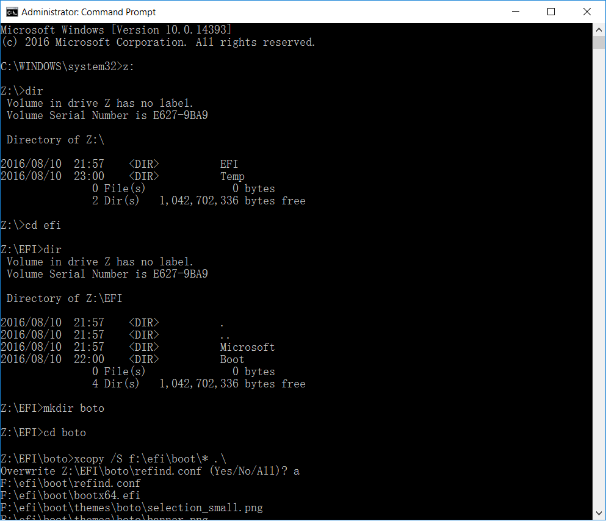

# OpenThos手动安装指南
## 适用用户
有着特殊安装需求的用户。
## 适用环境
### 主机要求
* 基于UEFI平台
* 系统能以UEFI方式引导
### 文档参考环境
Windows 10
### 权限
主机上的管理员权限
## 工具准备
### dd windows版
### mke2fs windows版
### bootice
### 由oto_img方式生成的openthos安装U盘
## 安装步骤
### 一、安装启动引导器BOTO
1. 打开diskpart，并通过diskpart将ESP分区挂载到z:盘  
  
2. 在z:盘创建efi/boto文件夹，并手动从oto_img方式生成的安装U盘上拷入boto启动文件。  
  
3. 创建boto启动引导项

### 二、安装OPENTHOS
### 三、设置OPENTHOS启动参数

