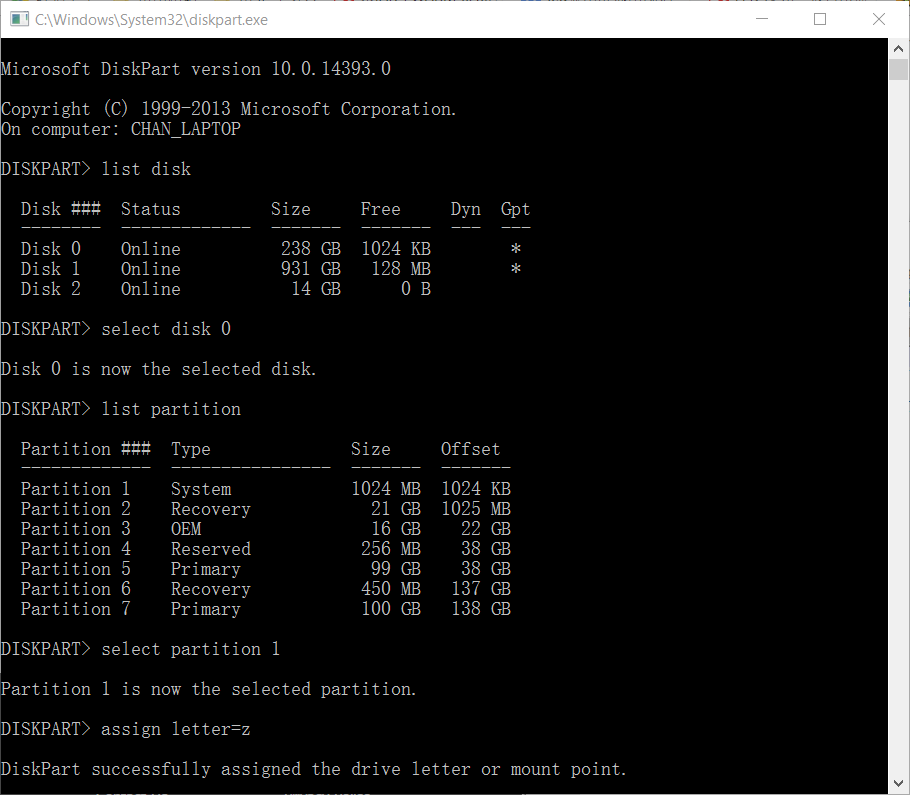

# OpenThos手动安装指南
## 适用用户
有着特殊安装需求的用户。
## 适用环境
### 主机要求
* 基于UEFI平台
* 系统能以UEFI方式引导
### 文档参考环境
Windows 10
### 权限
主机上的管理员权限
## 工具准备
### dd windows版
### mke2fs windows版
### bootice
### 由oto_img方式生成的openthos安装U盘
## 安装步骤
### 一、安装启动引导器BOTO  
1. 打开diskpart，并通过diskpart将ESP分区挂载到z:盘  
  
2. 在z:盘创建efi/boto文件夹，并手动从oto_img方式生成的安装U盘上拷入boto启动文件。  
  
3. 创建boto启动引导项  
  
在bootice工具上选择UEFI标签，将出现如下图的启动选项管理界面  
  
点击“add”按钮，加入目标为z:\efi\boto\bootx64.efi  
  
重命名该启动引导项为“Boto Boot Manager”  
  
通过点击“up”按钮，可以将“Boto Boot Manager”设为默认启动引导器。在某些机器，由于UEFI的设计缺陷可以无法调整启动顺序，请在UEFI设置环境中设置。  
### 二、安装OPENTHOS
选择有足够剩余空间的磁盘分区，在该磁盘上创建一个名为“OpenThos的文件夹”。  
向该分区拷入kernel、initrd.img、ramdisk.img、system.sfs等文件
  
在分区上创建data.img文件，并以ext4方式格式化该文件，注意-T为大写  

### 三、设置OPENTHOS启动参数

